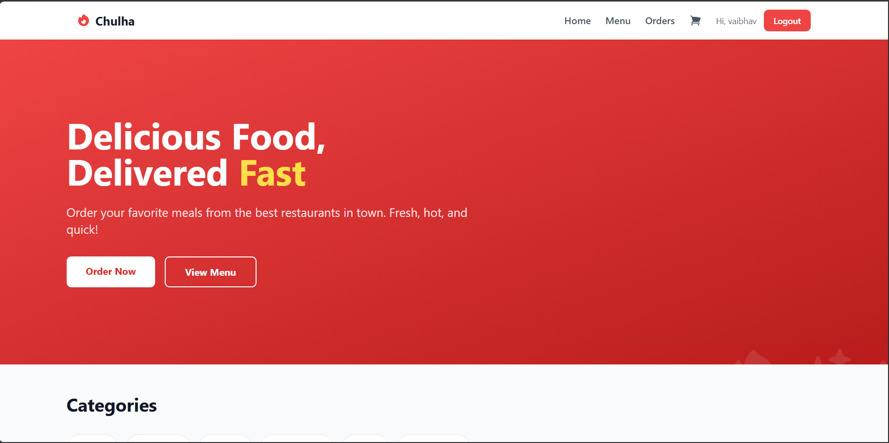
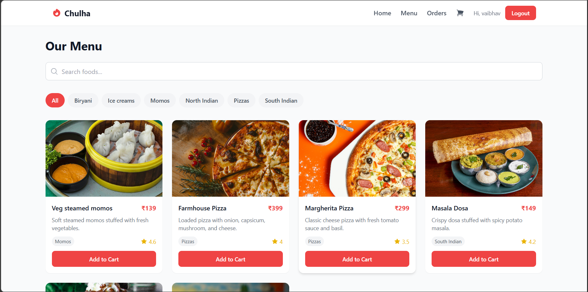
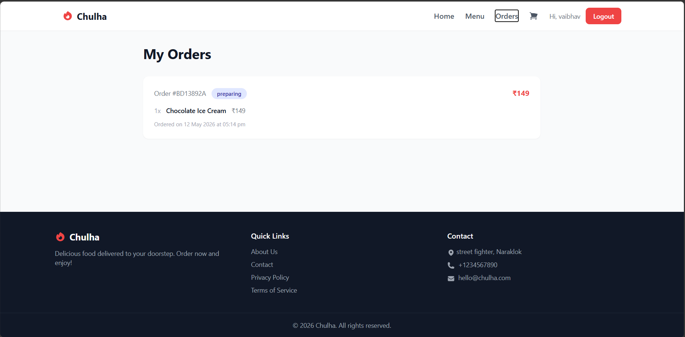
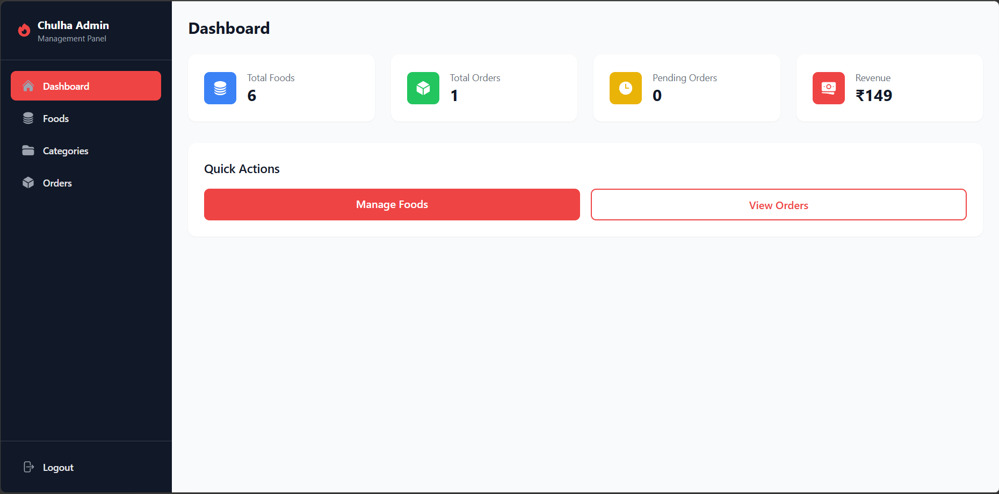
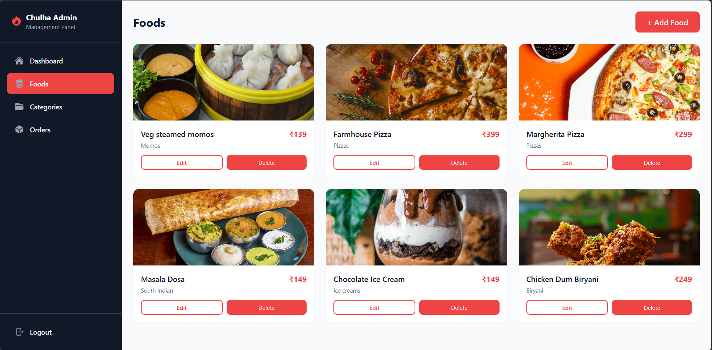
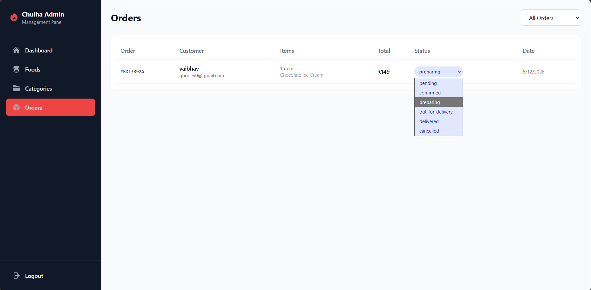

# Chulha - Food Delivery App

A full-stack MERN food delivery application with customer and admin interfaces.

## Screenshots

| | |
|---|---|
| **Customer - Home** | **Customer - Menu** |
|  |  |
| **Customer - Orders** | **Admin - Dashboard** |
|  |  |
| **Admin - Foods** | **Admin - Orders** |
|  |  |

## Tech Stack

- React + Vite, TailwindCSS, @heroicons/react
- Node.js + Express, MongoDB + Mongoose
- JWT Authentication, Context API, Axios

## Getting Started

### Prerequisites

- Node.js, MongoDB

### Setup

```bash
cd server && npm install && npm run dev
cd client && npm install && npm run dev
cd admin && npm install && npm run dev
```

- **Server:** http://localhost:5000
- **Client:** http://localhost:3000
- **Admin:** http://localhost:3001

### Seed Admin

```bash
Invoke-RestMethod -Uri http://localhost:5000/api/auth/register -Method Post -ContentType "application/json" -Body '{"name":"Admin","email":"admin@chulha.com","password":"admin123"}'
```

Then update role in MongoDB:

```bash
mongosh fooddelivery --eval 'db.users.updateOne({email:"admin@chulha.com"},{$set:{role:"admin"}})'
```
